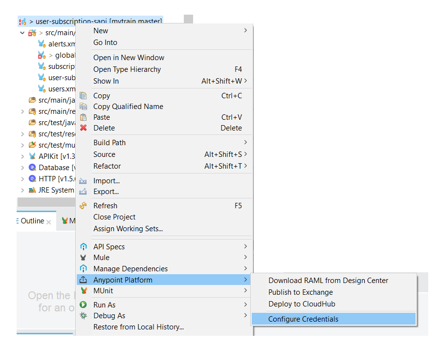

# Setup

## Prerequisites
 -  Sign-up for a fresh Anypoint Platform account for this setup.**
 -  Make sure use the same names are as it is, including the cases.
 -  Make sure to clone this repository to your local system.

## Publish Fragment & API's to Exchange
1. Create a new fragment named **National Rail Datatype Library** and import  from `raml/National Rail Datatype Library.zip` and publish it to Exchange with version 1.0.0.
2. Create a new API specification named **User Subscription SAPI** and import from `raml/User Subscription SAPI.zip`.
   - It will show an expection that national-rail-datatype.raml could not be imported.
   - To resolve this, you need to remove the existing "National Rail Datatype 1.0.0" dependency and add it again from the Exchange.
   - You would need to also re-map the references to the datatype.
   - This should resolve all the issues.
   - Go ahead and deploy the application now with the version 1.0.0
3. Similarly deploy all the other RAML's such as
   - National Rail SAPI
   - User Identity Mgmt SAPI
   - Incident Ticket Creation SAPI
   - Exception Categorization SAPI
   - Alert Notification PAPI
   - User Subscription EAPI
4. Add Json logger to the exchange.
    > Repo: https://github.com/mulesoft-consulting/json-logger
   - follow the instructions in this link https://github.com/njclabs/mytrains/tree/master#install-json-logger-to-exchange 
     (or)
    - https://blogs.mulesoft.com/dev/anypoint-platform-dev/json-logging-mule-4/


## Changes in the Local files
 1. Once the repository is cloned to your local system.
 2. Open the `mule-apps` folder.
 3. Open `common.xml` file.
 4. Update the app.username and app.password with newly created anypoint platform credentials
    ```
             <ap.username>****</ap.username>
             <ap.password>****</ap.password>
    ```
 5. Update the `mssvcs.ap.orgid` with Anypoint Platform -> Access Management -> Click on the Name of the Organization -> Organization info popup -> Organization Id
 6. Update `ap.client_id` and `ap.client_secret` with respecting Client Id and Client Secret from the access management.
     ```
         <mssvcs.ap.orgid>`organization-id`</mssvcs.ap.orgid>
         <mssvcs.exchange.repo.id>anypoint-exchange-${mssvcs.ap.orgid}</mssvcs.exchange.repo.id>

         <aa.ap.orgid>`organization-id`</aa.ap.orgid>
         <aa.exchange.repo.id>anypoint-exchange-${aa.ap.orgid}</aa.exchange.repo.id>

         <ap.client_id>`client-id`</ap.client_id>
         <ap.client_secret>`client-secret`</ap.client_secret>

     ```


## Changes in the Project

1. Import **user-subscription-sapi** into Anypoint Studio from `mule-apps` folder.
2. In the `global.xml` configuration file -> apikit router tag -> replace the organization-id with the id specified in the anypoint platform -> access management.
```
apikit:config name="userSubscriptionSapiConfig" 
    	api="resource::**organization-id**:user-subscription-sapi:1.0.0:raml:zip:user-subscription-sapi.raml" ...
``` 
3. Configure the anypoint credentials 


4. Try to run the project.

> **NOTE** There could be issues related to Arifact Resolution. We would need to resolve those to proceed further.